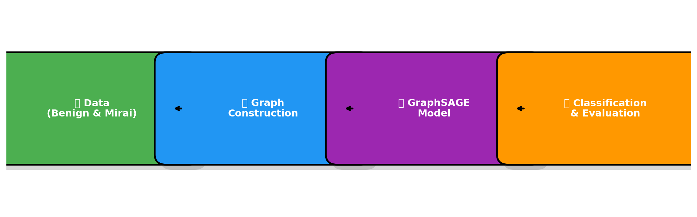

# 🚀 IoTSage: IoT Botnet Detection with GraphSAGE

[](https://www.python.org/) [](https://pytorch.org/) [](https://pytorch-geometric.readthedocs.io/) [](https://scikit-learn.org/stable/) [](LICENSE)

---

## 📊 Overview  

This project implements **IoT Botnet Detection** (Mirai attacks) using **GraphSAGE**, a Graph Neural Network (GNN) architecture.

Instead of treating IoT traffic as raw tabular data, we **represent device activity as a graph** where:
- Each node = snapshot of device activity
- Edges = temporal relationships (successive time windows)

The **GraphSAGE model** learns powerful embeddings from this graph and classifies malicious vs benign activity.

---

## 📂 Dataset  

The model uses IoT network traffic data:

- 🟢 **Benign** → Normal IoT device traffic
- 🔴 **Mirai** → Botnet attack traffic

Preprocessing steps:
- Handle missing values / NaNs / infinities
- Drop irrelevant columns (timestamps separated out)
- Scale features with `StandardScaler`

---

## ⚙️ Setup  

<details>
<summary>📥 Installation Steps (click to expand)</summary>

```bash
git clone https://github.com/meanderinghuman/IoTSage-IoT-Botnet-Detection-with-GraphSAGE.git
cd IoTSage-IoT-Botnet-Detection-with-GraphSAGE
pip install -r requirements.txt
```

Or manually install:  

```bash
pip install torch torch-geometric scikit-learn pandas numpy matplotlib gradio
```

⚠️ Ensure `torch-geometric`, `torch-scatter`, and `torch-sparse` versions match your PyTorch version.  

</details>

---

## 🏗️ Code Structure  

- **📂 Data Loading & Preprocessing**  
  - Loads benign & Mirai CSVs  
  - Cleans, scales, and labels data  

- **🔗 Graph Construction**  
  - Nodes = activity snapshots  
  - Edges = temporal adjacency  
  - Creates `torch_geometric.data.Data` object  

- **🧠 GraphSAGE Model**  
  - 2 × `SAGEConv` layers  
  - BatchNorm + ReLU + Dropout  
  - Final linear classifier  

- **🎯 Training & Evaluation**  
  - Train/val/test split  
  - Weighted cross-entropy for imbalance  
  - Early stopping on validation accuracy  
  - Metrics: Accuracy, Precision, Recall, F1, ROC-AUC  

- **📈 Visualization**  
  - Training curves  
  - Confusion matrix  
  - ROC curve  
  - Streamlit dashboard  

---

## 🧠 Model Architecture  

Below is the pipeline flow:  



---

## 🚀 Usage  

1. Place your datasets:  
   ```
   /content/drive/My Drive/IOT/benign/
   /content/drive/My Drive/IOT/mirai/
   ```  
   (or update `benign_dir` and `mirai_dir` in the script).  

2. Run the script:  

```bash
python iot_final.py
```

3. Start the dashboard:  

```bash
streamlit run web_app.py
```

---

## 📈 Evaluation Results  

| Metric     | Value      |
|------------|------------|
| ✅ Accuracy   | **96.12%** |
| 🎯 Precision  | **96.11%** |
| 🔁 Recall     | **96.12%** |
| 📊 F1-Score   | **96.11%** |
| 📉 AUC-ROC    | **0.9935** |

---

## 🌟 Future Improvements  

- Explore richer graph construction (e.g., IP addresses, port numbers, flow features).  
- Try advanced GNNs (e.g., GAT, GCN with attention).  
- Tune hyperparameters systematically.  
- Use sliding windows / causal sampling for temporal dynamics.  
- Test on more IoT botnets beyond Mirai.  

---

## 📜 License  
MIT License – free to use and modify.  

---

✨ **Project maintained by [Siddharth Pal](https://github.com/meanderinghuman)**